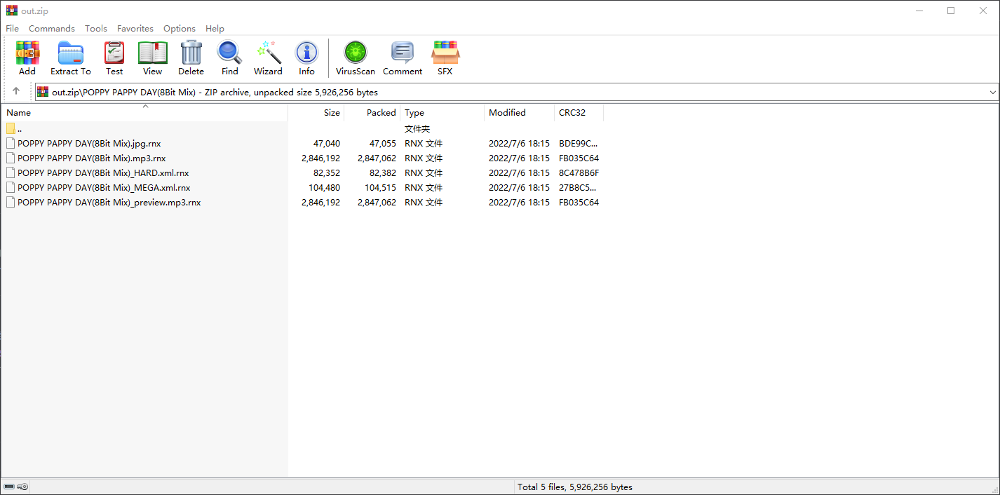

# Rena Standard Package v1

1. The Package file should be a zip.
2. All charts with its files should be placed in a directory, which the name should be equal to the name of Set.
3. Officially Encrypted file should be named with extension of `.rnx`, others should **NOT** be named with extension of `.rnx`.
4. The Music files should be named with `<SET_NAME>.mp3` or `<SET_NAME>.mp3.rnx`.
5. The Cover Image files should be named with `<SET_NAME>.jpg` or `<SET_NAME>.jpg.rnx`, as it should be JPEG encoding.
6. The Preview Music files should be named with `<SET_NAME>_preview.mp3` or `<SET_NAME>_preview.mp3.rnx`.
7. The Chart XML files should be named with `<SET_NAME>_<CHART_DIFFICULTY>.xml` or `<SET_NAME>_<CHART_DIFFICULTY>.xml.rnx`.

*: By default, packed charts only contain the difficulty class like 'MEGA', and the level is missing.

